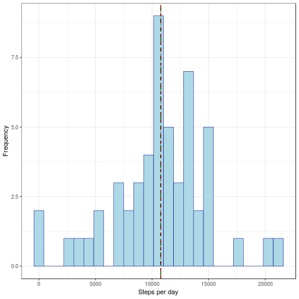
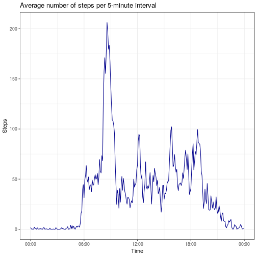
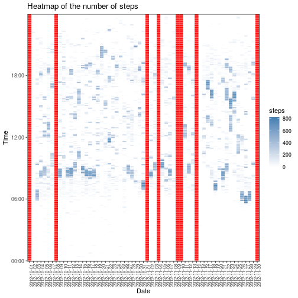
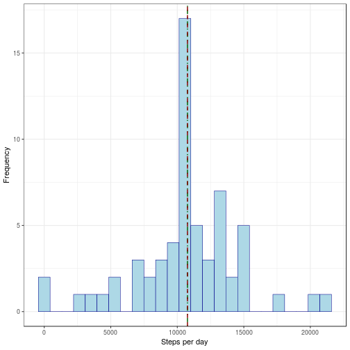
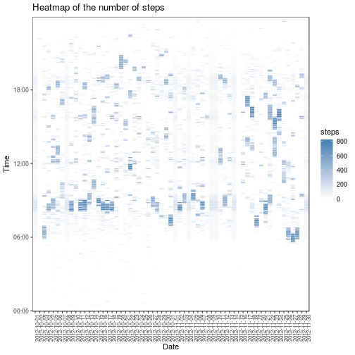
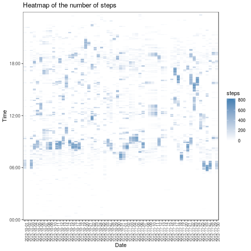
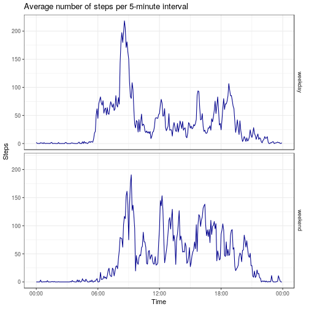

The extra packages used in this assignment are:

```r
library(dplyr)
library(tidyr)
library(ggplot2)
library(lubridate)
```


## Loading and preprocessing the data

In order to keep the files organized within the main folder, the file 'activity.csv' is required to be in a sub-folder 'Data'. The data is loaded using _read.csv()_ and stored as a 'tibbler' in the variable _activity\_data_.

```r
if(!file.exists("Data/activity.csv")){
    error("File 'activity.csv' was not found in the folder 'Data'.")
}
activity_data <- read.csv(
        "Data/activity.csv",
        header = TRUE,
        colClasses = c("integer","Date","integer")
    ) %>%
    tbl_df
```

The initial data is in the long format with three different variables:

* steps <_int_>: Number of steps taking in a 5-minute interval (missing values are coded as NA)

* date <_date_>: The date on which the measurement was taken in YYYY-MM-DD format. 
The experiment lasted for 61 days, from 2012-10-01 to 2012-11-30.

* interval <_int_>: Identifier for the 5-minute interval in which measurement was taken. 
Per day, there are 288 intervals.


```r
activity_data
```

```
## # A tibble: 17,568 x 3
##    steps date       interval
##    <int> <date>        <int>
##  1    NA 2012-10-01        0
##  2    NA 2012-10-01        5
##  3    NA 2012-10-01       10
##  4    NA 2012-10-01       15
##  5    NA 2012-10-01       20
##  6    NA 2012-10-01       25
##  7    NA 2012-10-01       30
##  8    NA 2012-10-01       35
##  9    NA 2012-10-01       40
## 10    NA 2012-10-01       45
## # ... with 17,558 more rows
```

```r
str(activity_data)
```

```
## Classes 'tbl_df', 'tbl' and 'data.frame':	17568 obs. of  3 variables:
##  $ steps   : int  NA NA NA NA NA NA NA NA NA NA ...
##  $ date    : Date, format: "2012-10-01" "2012-10-01" ...
##  $ interval: int  0 5 10 15 20 25 30 35 40 45 ...
```

```r
summary(activity_data)
```

```
##      steps             date               interval     
##  Min.   :  0.00   Min.   :2012-10-01   Min.   :   0.0  
##  1st Qu.:  0.00   1st Qu.:2012-10-16   1st Qu.: 588.8  
##  Median :  0.00   Median :2012-10-31   Median :1177.5  
##  Mean   : 37.38   Mean   :2012-10-31   Mean   :1177.5  
##  3rd Qu.: 12.00   3rd Qu.:2012-11-15   3rd Qu.:1766.2  
##  Max.   :806.00   Max.   :2012-11-30   Max.   :2355.0  
##  NA's   :2304
```

Having successfuly loaded the data, in order to facilitate the analysis of the activity per each day, we transform the initial data into a wide format with 62 variables:

* interval ("####") <_date_> : The label of interval on which the number of steps was recorded. The labels are all written with 4 characters, with 0's added on the left when necessary, e.g., "5" -> "0005".
* day ("%Y-%m-%d") <_int_>: The number of steps measured each interval, for all the 61 days.


```r
activity_data_wide <- activity_data %>% spread(date,steps)

for(i in 1:dim(activity_data_wide)[1]){
    activity_data_wide$interval[i] <- paste(
        c(
            rep("0",4-nchar(activity_data_wide$interval[i])),
            activity_data_wide$interval[i]),
        collapse = "" 
    )
}
```

In this wide format each row contains all the information relative to a given interval and therefore it is easier to calculate quantities for each interval and for each day. Quantities per day can be calculated down columns, while quantiteis for a given interlval during the whole period of the experiment can be calculated across rows.


```r
activity_data_wide 
```

```
## # A tibble: 288 x 62
##    interval `2012-10-01` `2012-10-02` `2012-10-03` `2012-10-04`
##    <chr>           <int>        <int>        <int>        <int>
##  1 0000               NA            0            0           47
##  2 0005               NA            0            0            0
##  3 0010               NA            0            0            0
##  4 0015               NA            0            0            0
##  5 0020               NA            0            0            0
##  6 0025               NA            0            0            0
##  7 0030               NA            0            0            0
##  8 0035               NA            0            0            0
##  9 0040               NA            0            0            0
## 10 0045               NA            0            0            0
## # ... with 278 more rows, and 57 more variables: `2012-10-05` <int>,
## #   `2012-10-06` <int>, `2012-10-07` <int>, `2012-10-08` <int>,
## #   `2012-10-09` <int>, `2012-10-10` <int>, `2012-10-11` <int>,
## #   `2012-10-12` <int>, `2012-10-13` <int>, `2012-10-14` <int>,
## #   `2012-10-15` <int>, `2012-10-16` <int>, `2012-10-17` <int>,
## #   `2012-10-18` <int>, `2012-10-19` <int>, `2012-10-20` <int>,
## #   `2012-10-21` <int>, `2012-10-22` <int>, `2012-10-23` <int>,
## #   `2012-10-24` <int>, `2012-10-25` <int>, `2012-10-26` <int>,
## #   `2012-10-27` <int>, `2012-10-28` <int>, `2012-10-29` <int>,
## #   `2012-10-30` <int>, `2012-10-31` <int>, `2012-11-01` <int>,
## #   `2012-11-02` <int>, `2012-11-03` <int>, `2012-11-04` <int>,
## #   `2012-11-05` <int>, `2012-11-06` <int>, `2012-11-07` <int>,
## #   `2012-11-08` <int>, `2012-11-09` <int>, `2012-11-10` <int>,
## #   `2012-11-11` <int>, `2012-11-12` <int>, `2012-11-13` <int>,
## #   `2012-11-14` <int>, `2012-11-15` <int>, `2012-11-16` <int>,
## #   `2012-11-17` <int>, `2012-11-18` <int>, `2012-11-19` <int>,
## #   `2012-11-20` <int>, `2012-11-21` <int>, `2012-11-22` <int>,
## #   `2012-11-23` <int>, `2012-11-24` <int>, `2012-11-25` <int>,
## #   `2012-11-26` <int>, `2012-11-27` <int>, `2012-11-28` <int>,
## #   `2012-11-29` <int>, `2012-11-30` <int>
```

## What is mean total number of steps taken per day?

If we remove the _NA_ values when calculating the total number of steps every day (essentially, this equivalent to replacing _NA_ by 0), then the total of steps per day can be calculated as

```r
activity_total_nona <- colSums(activity_data_wide[2:62], na.rm = TRUE)
```

We can now plot an histogram of the values of _activity\_total\_nona_ grouped in 25 bins:


```r
custom_histogram <- function(values, na.rm=TRUE){
    data.frame(steps = values, row.names = NULL) %>% ggplot(aes(steps)) +
    geom_histogram(bins=25, lwd=0.25, color = "darkblue", fill = "lightblue") + 
    geom_vline(aes(xintercept=mean(steps, na.rm = na.rm)), color="darkgreen", linetype="dotdash", size=0.7) +
    geom_vline(aes(xintercept=median(steps, na.rm = na.rm)), color="darkred", linetype="dashed", size=0.7) +
    labs(x="Steps per day",y="Frequency") +
    theme_bw(base_size = 11) +
    theme(
        strip.background = element_blank()
    )
}

custom_histogram(activity_total_nona)
```


```r
summary(activity_total_nona)
```

```
##    Min. 1st Qu.  Median    Mean 3rd Qu.    Max. 
##       0    6778   10395    9354   12811   21194
```

where the mean value, 9354, is marked by a green dot-dashed line and the median, 1.0395 &times; 10<sup>4</sup>, is marked by a red dashed line.

Notice that in the previous histogram there is a relatively large number of days with very small number of steps (see the leftmost bin in the previous histograms) which seems to come from the fact that the _NA_ values were removed and which could be responsible for the big descrepancy between the median and the mean values.  In order to investigate if this is the result of ignoring the _NA_ values when calculating the number of total steps per day, we first investigate the dsitribution of _NA_ values. If we calculate the relative number of _NA_ values in each day (values between 0 and 1) and display it in a table

```r
activity_data_wide[,2:62] %>% apply(
    2,
    FUN = function(x) round(sum(is.na(x))/288,5)
) %>% table
```

```
## .
##  0  1 
## 53  8
```
we find that there are 8 days where all the interval have _NA_ recorded values, while in all the other 53 days no _NA_ value is found. This suggests that we should look at the distribution of total steps per day while ignoring the 8 days for which no actual values are available

```r
activity_total_na <- colSums(activity_data_wide[2:62])
```

We can now re-plot an histogram of the values stored in the dataframe _activity\_total\_na_ for different number of bins:


```r
custom_histogram(activity_total_na)
```

```
## Warning: Removed 8 rows containing non-finite values (stat_bin).
```



This lowers considerably the number of days with 0 total steps. In fact,  if we now call _summary()_ on _activity\_total\_na_ 

```r
summary(activity_total_na)
```

```
##    Min. 1st Qu.  Median    Mean 3rd Qu.    Max.    NA's 
##      41    8841   10765   10766   13294   21194       8
```
we find that the minimum number of steps in a day is NA.

In the following table we compare the values of the median and mean value of steps when (1) ignoring _NA_ values when calculating the total steps per day and (2) ignoring the 8 days where all entries are _NA_ values:

|       |   NA values	|   Median	|   Mean	|
|---	|---    |---	|---	|
|   (1)    |  NA = 0	|   10395	|   9354	|
|   (2)    | 	NA days removed |   10765	|   10766	|

Notice that when the 8 days with _NA_ values are removed (2), the median and mean values are almost identical, in contrast with the situation in (1)

## What is the average daily activity pattern?

Since the _NA_ values in the data occur only for 8 days where no measurements are available for any interval, we can disregard these days while computing the mean number of steps in each interval during the duration of the experiment. The mean value of steps per interval is stored in the variable _activity\_mean_:

```r
activity_mean <- activity_data_wide %>%
    transmute(interval, mean = rowMeans(.[2:62],na.rm = TRUE))

activity_mean
```

```
## # A tibble: 288 x 2
##    interval   mean
##    <chr>     <dbl>
##  1 0000     1.72  
##  2 0005     0.340 
##  3 0010     0.132 
##  4 0015     0.151 
##  5 0020     0.0755
##  6 0025     2.09  
##  7 0030     0.528 
##  8 0035     0.868 
##  9 0040     0     
## 10 0045     1.47  
## # ... with 278 more rows
```

Below is a time series plot of th evolution of the average number of steps per interval throughout the day


```r
custom_timeseries <- function(df){ 
    df %>% ggplot(aes(as.POSIXct(interval, format = "%H%M"),mean)) + 
    geom_line(color = "darkblue") + 
    scale_x_datetime(date_labels = "%H:%M") +
    labs(x="Time",y="Steps", title = "Average number of steps per 5-minute interval") +
    theme_bw(base_size = 11) +
    theme(
        strip.background = element_blank()
    ) %>% return
}

custom_timeseries(activity_mean)
```



We store the value of the maximum number of average steps and of the corresponding interval in the vector _vector\_max_: 

```r
vector_max = filter(activity_mean, mean == max(mean))
```
and report it in the following table

| interval  | max steps |
|---      |---      |
| 0835 | 206|


## Imputing missing values

As stated above, our initial data has 8 days for which all of the 288 intervals have a _NA_ value. Thus, the number of _NA_ values is 2304. That this is so can be check by calling

```r
sum(is.na(activity_data_wide))
```

```
## [1] 2304
```

The distribution of number of steps and _NA_ values along the day for all 61 days can also be observed in the following heatmap where the _NA_ values are shown  in red


```r
custom_heatmap <- function(df) {
    df %>% 
    gather(key = "date", value = "steps",-1) %>%
    ggplot(aes(date,as.POSIXct(interval, format = "%H%M"))) +
    geom_tile(aes(fill = steps), colour = "white") + 
    scale_fill_gradient(low = "white", high = "steelblue", na.value ="red") + 
    scale_y_datetime(date_labels = "%H:%M",expand = c(0, 0)) +
    labs(x="Date",y="Time", title = "Heatmap of the number of steps") +
    theme_bw(base_size = 11) +
    theme(
        strip.background = element_blank(), 
        axis.text.x = element_text(size = 8, angle = 90)
    )
}

custom_heatmap(activity_data_wide)
```



As a a first strategy in filling in the missing data, we will use the mean values of number of steps for each 5-minute interval, as calculated in the previous section. We will store the result in the new (288x62) dataframe  _activity\_fill1_ defined below


```r
na_cols <- activity_data_wide[2:62] %>% 
    colSums(na.rm=FALSE) %>% 
    is.na %>% 
    which %>% 
    as.integer

activity_fill1_wide <- activity_data_wide

for(i in na_cols){
    for(j in 1:dim(activity_fill1_wide)[1]){
        activity_fill1_wide[j,1+i] <- activity_mean[j,2]
    }
}
```

We can now calculate the  number of total steps per day


```r
activity_total_fill1 <- colSums(activity_fill1_wide[2:62])
```

which we can then use to plot an histogram

```r
custom_histogram(activity_total_fill1)
```



As expected, the substitution of _NA_ values by the mean number of steps in each interval has led to an increase in the number of days with average total number of days, as seen by the increase in frequency of the bin corresponding to the mean and median values. Looking at the summary of _activity\_total\_fill1_

```r
summary(activity_total_fill1)
```

```
##    Min. 1st Qu.  Median    Mean 3rd Qu.    Max. 
##      41    9819   10766   10766   12811   21194
```
we find that in this more peaked distribution, the median and mean values almost do not change when compared with the previous results, but the distribution of the quantiles is altered.


If we look at the heatmap of the new dataframe _activity\_fill1\_wide_ we find that the red vertical lines that marked the _NA_ values have been replaced. However, the days with replaced values have timely distributions that standout with respect to the rest of the days, suggesting that this method of filling for missing data is not the most appropriate one. 


```r
custom_heatmap(activity_fill1_wide)
```



As a second strategy to fill in the missing data, we consider the possibity of filling in the _NA_ for a given interval in a given day by [interpolating](https://en.wikipedia.org/wiki/Interpolation) the values of the same interval in the adjacent days. This strategy is somewhat motivated by an apparent correlation in the heatmaps above between the numbers of steps in the same interval on consecutive days. When implementing this strategy we need to account as well for the special cases of the first and last days, which have only one adjacent day to pick values from, and to the pair '2012-11-09' and '2012-11-10' with is the only case of consecutive days with _NA_ values:

* First and last days: for each interval, the new value will be the mean of the same interval for the following or previous two days.
* Days '2012-11-09' and '2012-11-10': for each interval, the new value will be set using a linear interpolation between the corresponding values for the days '2012-11-08' and '2012-11-11'.


```r
activity_fill2_wide <- activity_data_wide

for(i in na_cols){
    if(i==1) {
        for(j in 1:dim(activity_fill2_wide)[1]){
            activity_fill2_wide[j,1+i] <- rowMeans(activity_data_wide[j,1+((i+1):(1+2))])
        }
    }
    else if(i==61){
        for(j in 1:dim(activity_fill2_wide)[1]){
            activity_fill2_wide[j,1+i] <- rowMeans(activity_data_wide[j,1+((i-1):(i-2))])
        }
    }
    else if(is.na(activity_data_wide[j,1+i+1])) {
        for(j in 1:dim(activity_fill2_wide)[1]){
            activity_fill2_wide[j,1+i] <- 
                (2/3)*activity_data_wide[j,1+i-1] + (1/3)*activity_data_wide[j,1+i+2]
        }
    }
    else if(is.na(activity_data_wide[j,1+i-1])) {
        for(j in 1:dim(activity_fill2_wide)[1]){
            activity_fill2_wide[j,1+i] <- 
                (1/3)*activity_data_wide[j,1+i-2] + (2/3)*activity_data_wide[j,1+i+1]
        }
    }
    else {
        for(j in 1:dim(activity_fill2_wide)[1]){
            activity_fill2_wide[j,1+i] <- rowMeans(activity_data_wide[j,1+c(i-1,i+1)])
        }
    }
}
```

We can now calculate the  number of total steps per day


```r
activity_total_fill2 <- colSums(activity_fill2_wide[2:62])
```

which we can then use to plot an histogram

```r
custom_histogram(activity_total_fill2)
```


We now find that this method of filling in for missing data does not lead to such a peaked distribution around the mean value, as in the previous case. Looking at the summary of _activity\_total\_fill2_

```r
summary(activity_total_fill2)
```

```
##    Min. 1st Qu.  Median    Mean 3rd Qu.    Max. 
##      41    8615   10571   10490   12883   21194
```
we find that in this case the distribution of the quartiles is less altered but the median and mean values are lower..

If we look at the heatmap of the new dataframe _activity\_fill2\_wide_ we find that once more the red vertical lines that marked the _NA_ values have been replaced and that the days with replaced values standout less in the heatmap, although they can still be identified by the _visual smoothing effect_ that they produce. A more complete study could try to understand the interpolation mechanism should use more than the tweo near-neighbour days and whether the rules used for the first and final day and for the  '2012-11-09'-'2012-11-10' pair could be improved.


```r
custom_heatmap(activity_fill2_wide)
```



Finally, in the following table we present the values of the median and mean values of total steps per day when (1) ignoring _NA_ values when calculating the total steps per day; (2) ignoring the 8 days where all entries are _NA_ values; (3) the missing values are replaced by the mean value of the corresponding interval and (4) the missing values are replaced using the simple interpolation method described above.

|       |   NA values	|   Median	|   Mean	|
|---	|---    |---	|---	|
|   (1)    |  NA = 0	|   10395	|   9354	|
|   (2)    | 	NA days removed |   10765	|   10766	|
|   (3)    | 	NA = interval mean |   10766	|   10766	|
|   (4)    | 	NA = linear interpolation |   10571	|   10490	|

## Are there differences in activity patterns between weekdays and weekends?

In order to study the possible difference in patterns between weekdays and weekends, we will use the dataframe _activity\_fill2\_wide_ where the _NA_ values were replaced using the simple interpolation method described above. From _activity\_fill2\_wide_ we create a new data frame with 3 variables:

* interval ("####") <_char_>: The label of interval on which the number of steps was recorded.
* date <_fct_>: A label that indicates whether the number of steps was averaged over weekends or weekdays.
* mean <_int_>: The average number of steps for the respective interval over the weeked or the weekdays.


```r
activity_mean2 <- activity_fill2_wide %>%
    gather(key = "date", value = "steps", (2:62)) %>%
    mutate( date = wday(date) %>% (function(x) ifelse(x %in% c(1,7),"weekend","weekday")) %>% factor) %>%
    group_by(interval,date) %>%
    summarise(mean = mean(steps))

activity_mean2
```

```
## # A tibble: 576 x 3
## # Groups:   interval [?]
##    interval date      mean
##    <chr>    <fct>    <dbl>
##  1 0000     weekday 2.02  
##  2 0000     weekend 0     
##  3 0005     weekday 0.4   
##  4 0005     weekend 0     
##  5 0010     weekday 0.156 
##  6 0010     weekend 0     
##  7 0015     weekday 0.178 
##  8 0015     weekend 0     
##  9 0020     weekday 0.0889
## 10 0020     weekend 0     
## # ... with 566 more rows
```

Using the _custom\_timeseries()_ function defined previously and adding a _facet\_grid()_ that runs over the values of the factor 'date', we can then easily plot the time series of the average number of steps per interval over the weekend and during the weekdays:


```r
custom_timeseries(activity_mean2) %>% + facet_grid(activity_mean2$date~.)
```



From the plots above, it is possible to see that, on average, the subject of the experiment started his/hers activity later in the day during the weekends--for weekdays the step number has a sharp increase around 6:00 and another sharp increase around the peak around 8:00 while for weekends the step number increases gradualy from 6:00 until a peak around 9:00-- and remained active until later in the day--on weekdays the average number of steps per interval goes below 50 around 19:00 while on weekends it remains above 50 until aroun 21:00. In addition, there seems to be a higher number of steps between 12:00 and 18:00 on weekends when compared with weekdays.
